# Objective
Understand and implement basic HTTP methods (GET and POST) in an Express application. Handle URL and query parameters in Express routes, and practice sending and receiving JSON data.

# Instructions
## Part 1: Create and Clone Your GitHub Repository
### Create a New GitHub Repository:

Name your repository express-http-methods.

Initialize it with a .gitignore for Node.js and a README.md.

### Clone Your Repository:

Clone your repository to your local machine.

Navigate to the cloned repository's directory to begin your project setup.

## Part 2: Setup and Configuration
### Initialize a Project:

Within your project directory, run npm init -y to generate necessary files.
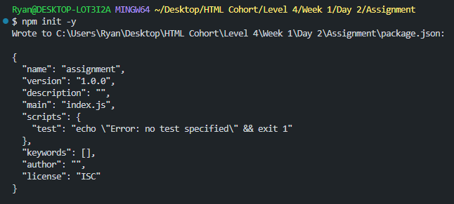

### Install Dependencies:

Add the necessary dependencies with npm install express.
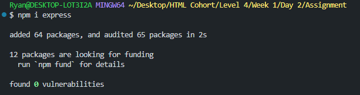

## Part 3: Implement Routes for GET and POST Requests
### Setup Basic Routing:

Create a new file named index.js.
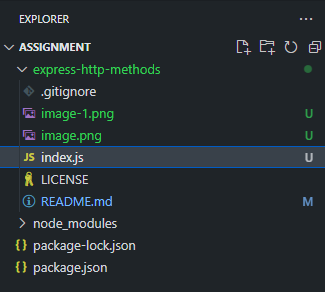

Set up routes to handle GET and POST requests.
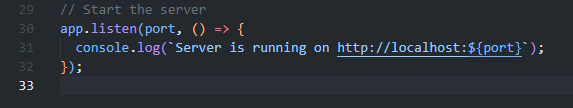
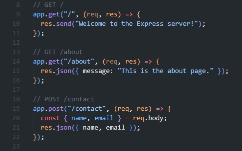

### Middleware:

Include middleware to parse JSON bodies.

### Create Routes:

Implement routes to handle the following:

A GET request to the root (/) that responds with a welcome message.
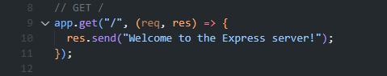

A GET request to /about that responds with a JSON message.
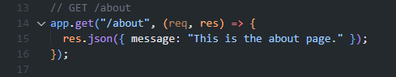

A POST request to /contact that responds with the submitted data.
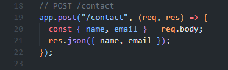

Ensure there is a catch-all route for undefined routes that returns a 404 status code.
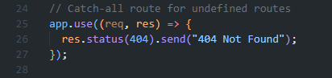

## Part 4: Handle URL and Query Parameters
### URL Parameters:

Add a route to handle URL parameters for /user/:id.
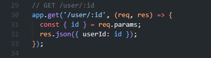
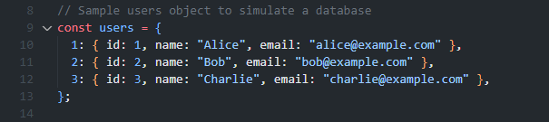

### Query Parameters:

Add a route to handle query parameters for /search.
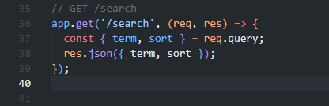

## Part 5: Testing
### Test the Routes:

Use Thunder Client or Postman to test the routes.

### Example tests:

POST /contact: Send a JSON body with name and email.
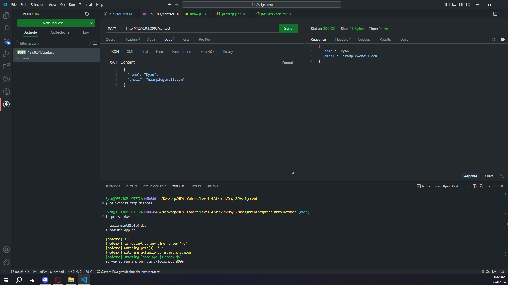

GET /user/:id: Replace :id with a sample user ID.
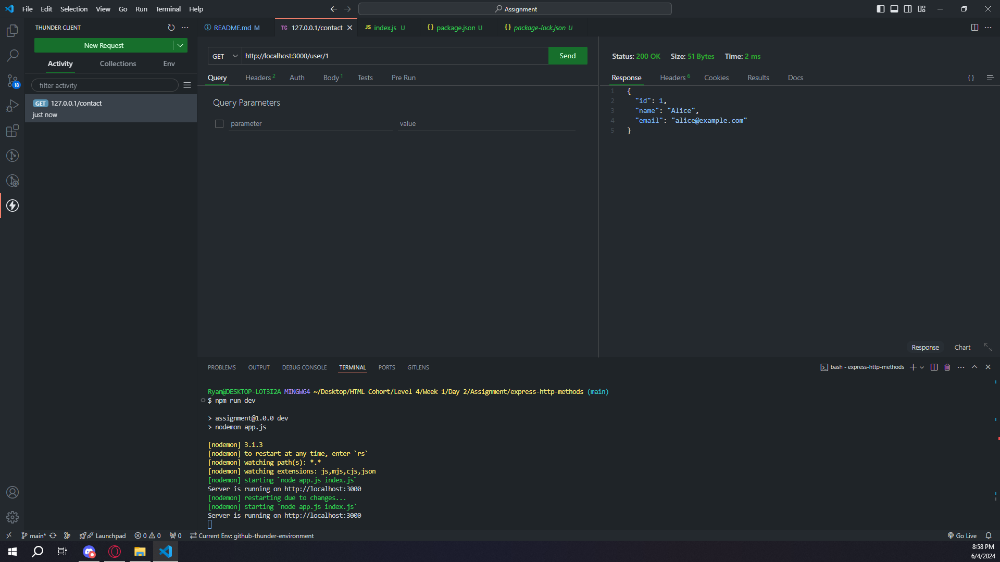

GET /search: Include query parameters term and sort.
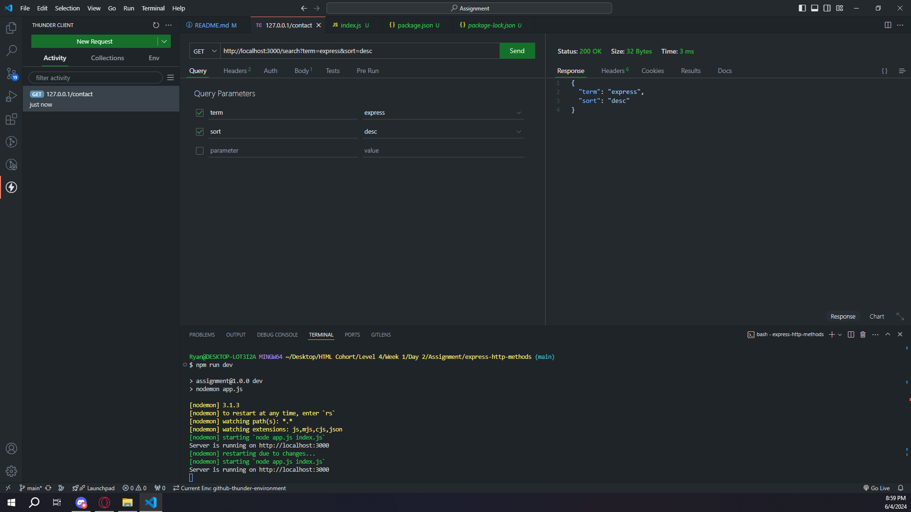

## Submission
GitHub Repository: Submit the URL of your GitHub repository. Ensure it includes all necessary files to run the project and an updated README.md, and is set to public.
https://github.com/rja87sd/express-http-methods

Additional Requirements (if any): Please specify if you need the assignment deployed or any screenshots for verification.

## Credits
Credit to ChatGPT for assistance and code comments.